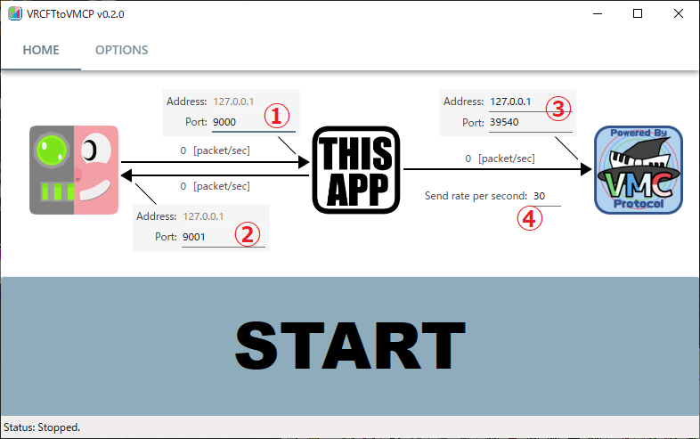
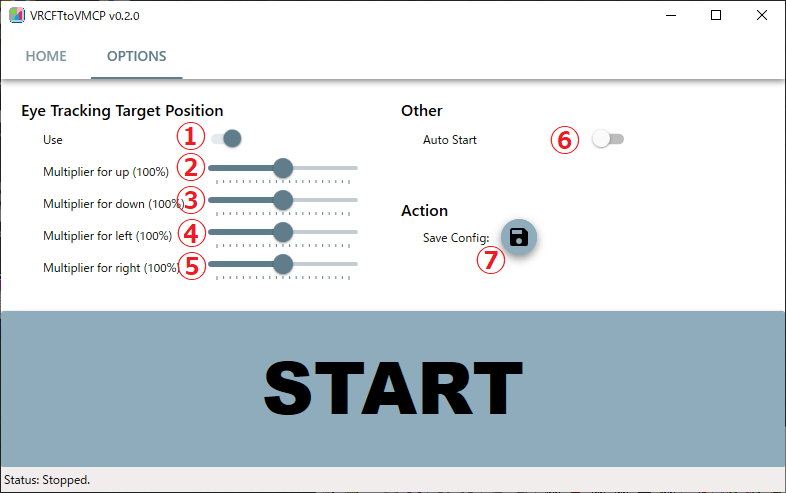

# VRCFTtoVMCP

VRCFaceTracking からフェイストラッキングデータを受け取り、そのデータを PerfectSync の Blendshape に変換して VMCProtocol で送信する Windows アプリです。

VRCFaceTracking (https://github.com/benaclejames/VRCFaceTracking) は Vive Pro Eye や Quest Pro などといったフェイストラッキングに対応したデバイスのフェイストラッキングデータを VRChat に OSC で送信するアプリです。

本アプリは VRCFaceTracking が送信するフェイストラッキングデータを VRChat の代わりに受信します。
そして受信したフェイストラッキングデータを PerfectSync の Blendshape に変換して VMCProtocol で送信します。

本アプリが送信した VMCProtocol のメッセージは VirtualMotionCapture などといった VMCProtocol による PerfectSync 対応アプリで受け取ることができます。

# 注意

本アプリは自分用に作っているため安定した動作を保証しません。

本アプリと VRChat を同時に使用できません。

VRCFaceTracking の仕様変更などにより本アプリが動作しなくなる可能性があります。

# 環境構築

## VRCFaceTracking

1. https://docs.vrcft.io/ に従い VRCFaceTracking をセットアップします。

## VRCFTtoVMCP

1. .NET6.0のSDKまたはランタイムをインストールします。

2. https://github.com/tkns3/VRCFTtoVMCP/releases より VRCFTtoVMCP.exe をダウンロードします。

3. ダウンロードした VRCFTtoVMCP.exe を任意のフォルダに置きます。

## VRChat

1. Steam で VRChat をインストールします。

2. VRChat を起動してアバターを表示し操作できる状態まで進めます。

3. VRChat を終了します。

※ VRChat で一度は OSC を有効にしないとダメかもしれない？未確認。

# 使い方

## 起動方法

Quest Pro と VirtualMotionCapture を使う例。

1. Quest Pro を (Air)Link で接続します。

2. PC で VRCFaceTracking を起動します。 ※1

3. PC で SteamVR を起動します。 ※1

4. VRCFTtoVMCP を起動します。

6. VirtualMotionCapture で VRM を読み込みキャリブレーションします。

7. VirtualMotionCapture の モーション受信(VMCProtocol) を有効にします。

9. VRCFTtoVMCP の Start をクリックします。

※1 VR 内で Oculus や SteamVR のダッシュボードから操作しない。マウスやキーボードなどを使いPCで起動する。

## VRCFTtoVMCP の設定

### HOME 画面

- ① THIS APP の受信ポート
  - 基本的に変更不要です。
- ② VRCFaceTracking の受信ポート
  - 基本的に変更不要です。
- ③ VMCProtocol 受信アプリのアドレスとポート
  - VMCProtocol を受信するアプリにあわせて変更してください。
  - デフォルトは VirtualMotionCaptrue にあわせています。
- ④ Send rate per second
  - 秒間あたりの VMCProtocol メッセージ送信数です。
  - 数値を大きくすると表情変化が滑らかになります。ただし VRCFaceTracking の送信頻度のほうが頭打ちとなり 30 より大きくしても効果は少ないかもしれません。

### OPTIONS 画面

- ① Eye Tracking Target Position: Use
  - オンにすると VMCProtocol の Eye Tracking Target Position (/VMC/Ext/Set/Eye) を送信します。これにより VRM Look At Bone Applyer を設定しているアバターはボーンによる視線制御が行われます。
  - Blendshape の EyeLook** で瞳の向きを変えているアバターを使う場合はオフにする、もしくはオンにして Multiplier の数値を下げることをお勧めします。
- ② Eye Tracking Target Position: Multiplier for up
  - Eye Tracking Target Position による視線の上方向への移動量の倍率です。
- ③ Eye Tracking Target Position: Multiplier for down
  - Eye Tracking Target Position による視線の下方向への移動量の倍率です。
- ④ Eye Tracking Target Position: Multiplier for left
  - Eye Tracking Target Position による視線の左方向への移動量の倍率です。
- ⑤ Eye Tracking Target Position: Multiplier for right
  - Eye Tracking Target Position による視線の右方向への移動量の倍率です。
- ⑥ Other: Auto Start
  - オンにするとアプリ起動時に自動で START します。
- ⑦ Aciton: Save Config
  - クリックすると設定ファイル VRCFTtoVMCP.json を実行ファイルと同じフォルダに作成します。

# 使用OSS

## uOSC
- https://github.com/hecomi/uOSC
- 開発者: hecomi
- ライセンス: MIT license
- 備考: 参考に一部実装をコピー

## Newtonsoft Json.NET
- https://www.newtonsoft.com/json
- 開発者: James Newton-King
- ライセンス: MIT license

## MaterialDesignThemes
- https://github.com/MaterialDesignInXAML/MaterialDesignInXamlToolkit
- 開発者: James Willock
- ライセンス: MIT license

